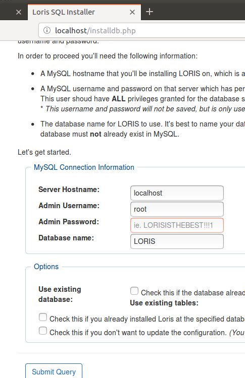
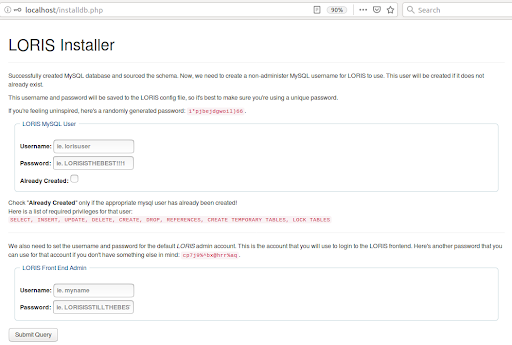
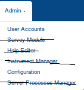

# [](https://travis-ci.org/aces/Loris) LORIS setup for the Medical Informatics Platform of the Human Brain Project

This is a setup of LORIS' v21.0.1 tailored for the hospitals that have joined the Human Brain Project and use the [Medical Informatics Platform](https://github.com/HBPMedical).

<br>

## Installation

### Dockerization

* Clone this repo
* run docker-compose up --build
#* visit localhost:8088/installdb.php
#  * Mysql root access -> 172.28.1.2, root, neopass
#  * for Mysql loris user -> lorisuser, neopass
#  * loris frontpage user -> lorisuser, 1234
* docker exec -it loris_apache bash
curl_query.sh creates the db schema, mysqluser and frontend user of loris
    * Mysql root access -> 172.28.1.2, root, neopass
    * for Mysql loris user -> lorisuser, neopass
    * loris frontpage user -> lorisuser, 1234
* bash /home/lorisadmin/curl_query.sh
(note that when you execute imaging_install_aueb.sh, your working directory must be /data/loris/bin/mri, also you must source beforehand minc-toolkit-config.sh )
* source /opt/minc/1.9.17/minc-toolkit-config.sh
* cd /data/loris/bin/mri
* execute imaging_install_aueb.sh in /data/loris/bin/mri
* bash imaging_install_aueb.sh

#### System Requirements

 * Apache **2.4** or higher
 * MySQL >= 5.7 (or MariaDB >= 10.3)
 * PHP <b>7.2</b> or higher
 * [Composer](https://getcomposer.org/)
 * NodeJS <b>8.0</b> or higher

#### Getting Prerequisites
 ```
sudo apt-get update
sudo apt-get install -y mysql-server mysql-client
sudo apt-get install -y zip curl wget python-software-properties software-properties-common
sudo add-apt-repository ppa:ondrej/php
sudo apt-get update
sudo apt-get install -y apache2
sudo apt-get install -y php7.2 php7.2-mysql php7.2-xml php7.2-json php7.2-mbstring php7.2-gd php-ast
sudo apt-get install -y composer
sudo apt-get install -y libapache2-mod-php7.2
sudo a2enmod php7.2
sudo service apache2 restart
 ```

#### Install Steps

   Installation Steps for installing LORIS in a remote machine (VM or not).

1. Creating a User for LORIS

```shell
sudo useradd -U -m -G sudo -s /bin/bash lorisadmin
sudo passwd lorisadmin
su - lorisadmin
```

<b>Important: All steps from this point forward must be executed by lorisadmin user</b>

ssh into your remote machine as a user in the sudo group (like root)

``` shell
sudo useradd -U -m -G sudo -s /bin/bash lorisadmin
sudo passwd lorisadmin
su - lorisadmin
whoami
```

You should see lorisadmin.


2. Downloading LORIS
Make sure you're ssh'd as lorisadmin
Note that the path is assumed to be var/www/loris however your own path may be var/www/<project-name>, depending on your setup.

```shell
cd /var/www
git clone https://github.com/aces/Loris.git
wget https://github.com/aces/Loris/archive/v21.0.0.zip -O release.zip
sudo unzip release.zip
sudo mv Loris* loris    
sudo chown -R lorisadmin.lorisadmin /var/www/loris
sudo service apache2 restart     
cd /var/www/loris/tools    
./install.sh  (when prompted, give as project name ‘loris’)
sudo a2enmod rewrite
sudo a2ensite loris
sudo chmod 775 /var/www/loris/project/
service apache2 reload
sudo service apache2 restart
```

3. Install Composer

For more information, please read the [Installing Loris wiki page](https://github.com/aces/Loris/wiki/Installing-Loris).

```shell
curl -sS https://getcomposer.org/installer -o composer-setup.php
php -r "if (hash_file('SHA384', 'composer-setup.php') === 'a5c698ffe4b8e849a443b120cd5ba38043260d5c4023dbf93e1558871f1f07f58274fc6f4c93bcfd858c6bd0775cd8d1') { echo 'Installer verified'; } else { echo 'Installer corrupt'; unlink('composer-setup.php'); } echo PHP_EOL;"
sudo php composer-setup.php --install-dir=/usr/local/bin --filename=composer
```

in case of multiple versions of php

```shell
sudo update-alternatives --set php /usr/bin/php7.2
```

#### Nodejs installation

```shell
curl -sL https://deb.nodesource.com/setup_8.x | sudo -E bash -
sudo apt-get install -y nodejs
```

#### Troubleshooting:

In case you have this error in the loris-error.log: sudo cat /var/log/apache2/loris-error.log

AH00037: Symbolic link not allowed or link target not accessible: /var/www/loris/htdocs/fontawesome,

You may need to use make

cd /var/www/loris
make

4. Create database schema and config.xml





5. Install Imaging pipeline

https://github.com/aces/Loris-MRI

```shell
sudo mkdir -p /data/loris/bin/mri
sudo chown -R lorisadmin:lorisadmin /data/loris
cd /data/loris/bin
git clone -b master https://github.com/aces/Loris-MRI.git mri

sudo apt-get install python3
sudo apt-get install python3-dev
sudo apt-get install python3-pip
sudo apt-get install libmysqlclient-dev
sudo pip3 install virtualenv
From http://bic-mni.github.io/

sudo apt-get install libc6 libstdc++6 imagemagick perl
```

Download
1) minc-toolkit-<version>.deb
2) minc-toolkit-testsuite-<version>.deb
4) beast-library-<version>.deb
3) bic-mni-models-<version>.deb

```shell
cd ~
wget http://packages.bic.mni.mcgill.ca/minc-toolkit/Debian/minc-toolkit-1.9.16-20180117-Ubuntu_16.04-x86_64.deb
wget http://packages.bic.mni.mcgill.ca/minc-toolkit/Debian/minc-toolkit-testsuite-0.1.3-20131212.deb
wget http://packages.bic.mni.mcgill.ca/minc-toolkit/Debian/bic-mni-models-0.1.1-20120421.deb
wget http://packages.bic.mni.mcgill.ca/minc-toolkit/Debian/beast-library-1.1.0-20121212.deb
```

Install .deb packages

```shell
sudo dpkg -i minc-toolkit-1.9.16-20180117-Ubuntu_16.04-x86_64.deb sudo dpkg -i minc-toolkit-testsuite-0.1.3-20131212.deb
sudo dpkg -i bic-mni-models-0.1.1-20120421.deb
sudo dpkg -i beast-library-1.1.0-20121212.deb
source /opt/minc/1.9.16/minc-toolkit-config.sh

cd /data/loris/bin/mri/

sudo mkdir /data/incoming

bash ./imaging_install.sh
```


Edit .bashrc and append

source /data/loris/bin/mri/environment

Reboot, because loris-python is not being found.

Customize interface
In order to customize the interface e.x. remove “Clinical”, “Reports”, “Tools” tabs and the marked options from “Admin” tab we do the following update operation at LorisMenu table by setting the column Visible to false.

UPDATE `LORIS`.`LorisMenu` SET `Visible`='false' WHERE `ID`='2';
UPDATE `LORIS`.`LorisMenu` SET `Visible`='false' WHERE `ID`='4';
UPDATE `LORIS`.`LorisMenu` SET `Visible`='false' WHERE `ID`='5';
UPDATE `LORIS`.`LorisMenu` SET `Visible`='false' WHERE `ID`='30';
UPDATE `LORIS`.`LorisMenu` SET `Visible`='false' WHERE `ID`='31';
UPDATE `LORIS`.`LorisMenu` SET `Visible`='false' WHERE `ID`='32';
UPDATE `LORIS`.`LorisMenu` SET `Visible`='false' WHERE `ID`='34';





6. Quality control

In order to mark all newly inserted mincs as "Pass"

Images in our case are ought to be initialized with a 'PASS' label upon being imported to LORIS. This is done by triger "files_AFTER_INSERT"

```shell
CREATE DEFINER = CURRENT_USER TRIGGER `LORIS`.`files_AFTER_INSERT` AFTER INSERT ON `files` FOR EACH ROW
BEGIN
	INSERT INTO files_qcstatus
	SET	FileID = NEW.FileID,
     SeriesUID = NEW.SeriesUID,
     EchoTime = NEW.EchoTime,
     QCStatus = "Pass",
     QCFirstChangeTime = unix_timestamp( NOW() ),
     QCLastChangeTime = unix_timestamp( NOW() );
END
```

Loris does not store the StudyID of the mincs files into the database. One workaround is to modify the "files" table

```shell
ALTER TABLE files ADD FileStudyID TEXT DEFAULT NULL;
```

and execute fill_studyid.py which read the mnic header of each file to fill the missing studyid information.

```shell
sudo apt-get install minc-tools
python fill_studyid.py
```

In order to discriminize which files with "PASS" have been examined for the next stage we add one column

```shell
ALTER TABLE files ADD FileStudyComplete INT DEFAULT 0;
```

7. Insert Data

Make sure that pre and post folders exists, otherwise create them.

```shell
cd ~
mkdir pre post
```

Place your dicoms files to /home/loris/pre

It is recommended to make use of https://github.com/aueb-wim/DataQualityControlTool/ to find invalid .dcm files that you should not include while uploading a dicom, otherwise the upload will fail.

Execute

```shell
python dicom_uploader.py
```

dicom_uploader.py will process each dicom-folder within the folder <b>pre</b> and afterwards moves that dicom-folder to the <b>post</b> folder.
